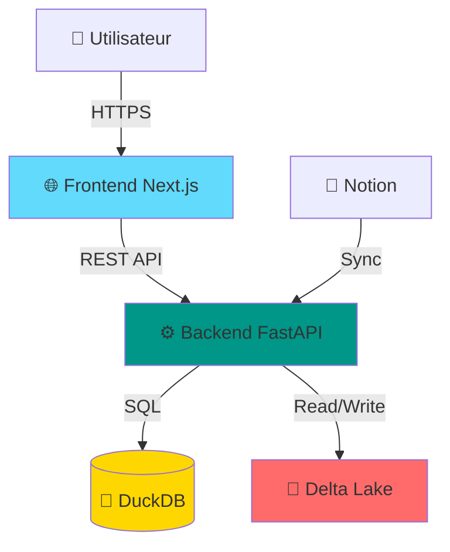
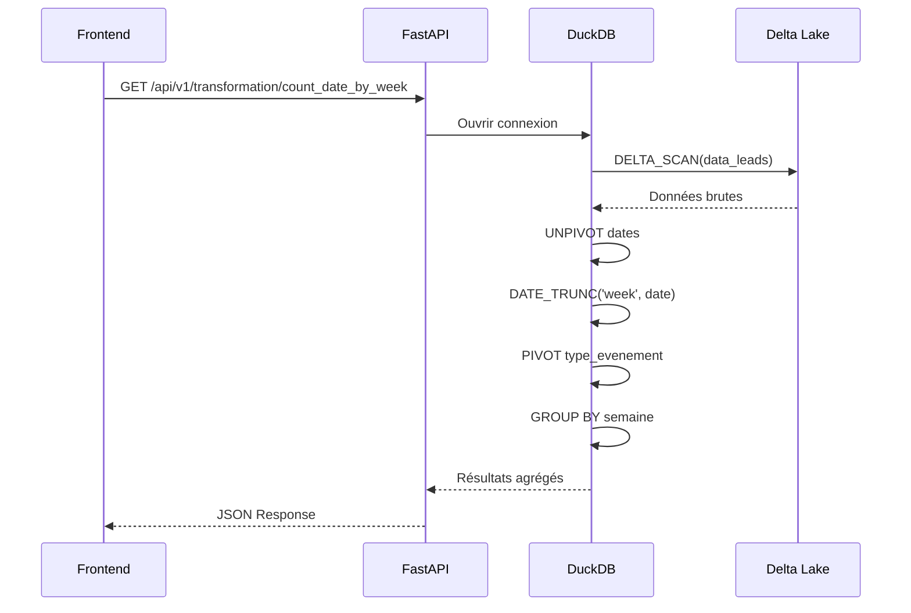
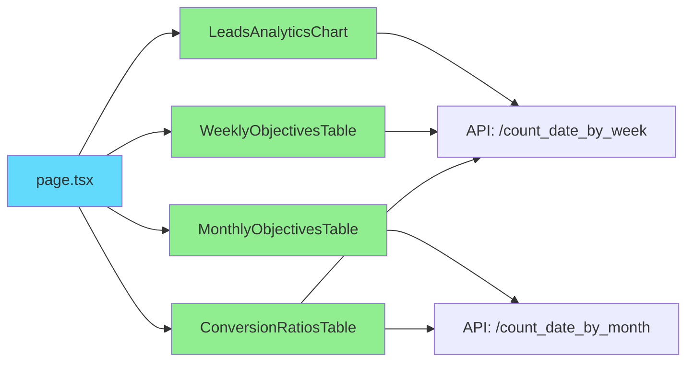
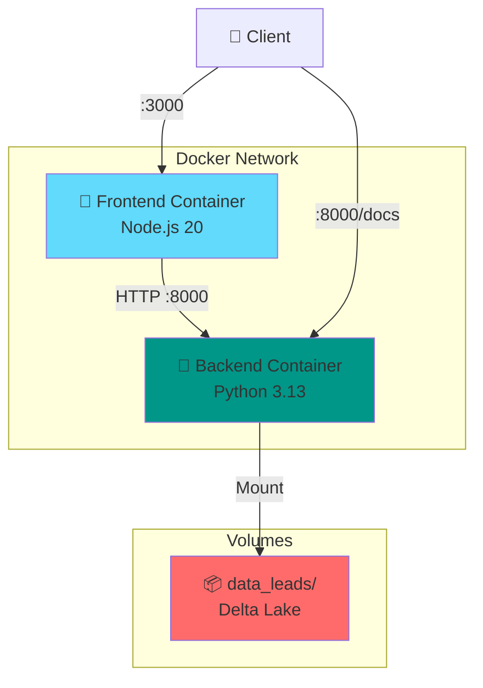
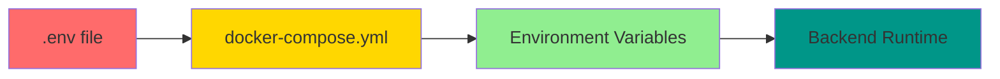

# Architecture

Ce document décrit l'architecture complète de l'application Lead Analytics Dashboard.

## Vue d'ensemble



## Stack technique

### Frontend

- **Framework** : Next.js 16 avec App Router
- **UI Library** : React 19
- **Styling** : Tailwind CSS + shadcn/ui
- **Graphiques** : Recharts
- **HTTP Client** : Axios
- **Package Manager** : pnpm

**Caractéristiques** :
- Server-Side Rendering (SSR)
- Client-Side Rendering (CSR) pour les composants interactifs
- Optimisation automatique des images
- Code splitting automatique
- Hot Module Replacement (HMR)

### Backend

- **Framework** : FastAPI 0.120
- **Base de données analytique** : DuckDB 1.4
- **Stockage** : Delta Lake 1.2
- **Package Manager** : uv
- **Python** : 3.13

**Caractéristiques** :
- API REST asynchrone
- Documentation OpenAPI automatique
- Validation Pydantic
- CORS configuré
- Logging structuré (Loguru)

### Stockage des données

- **Format** : Delta Lake (Parquet + transaction log)
- **Compression** : Snappy
- **Localisation** : `backend/data_leads/`

**Avantages** :
- ACID transactions
- Time travel
- Schema evolution
- Versioning automatique
- Lecture optimisée

## Architecture Backend

### Structure des modules

```
backend/
├── app.py                      # Point d'entrée FastAPI
├── core/
│   ├── config.py              # Configuration globale
│   └── openapi_docs_model.py  # Modèles OpenAPI
└── routers/
    ├── ingestion_leads/       # Ingestion des données
    │   ├── main.py           # Routes d'ingestion
    │   ├── model.py          # Modèles Pydantic
    │   ├── utils.py          # Utilitaires
    │   └── docs.py           # Documentation OpenAPI
    └── transformation/        # Transformations analytiques
        ├── main.py           # Routes de transformation
        ├── docs.py           # Documentation OpenAPI
        └── request/          # Requêtes SQL
            ├── count_by_week_form_deltalake.sql
            └── count_by_month_form_deltalake.sql
```

### Flow de données



### Requêtes SQL

#### Agrégation par semaine

```sql
WITH unpivoted_and_weekly AS (
  SELECT
    DATE_TRUNC('week', date) AS semaine,
    type_evenement,
    date
  FROM (
    UNPIVOT DELTA_SCAN('/path/to/data_leads')
    ON date_appel_booke,
       date_appel_propose,
       date_prise_contact,
       date_relance,
       date_reponse_prospect
    INTO
    NAME type_evenement
    VALUE date
  )
  WHERE date IS NOT NULL
)
PIVOT unpivoted_and_weekly
ON type_evenement
USING COUNT(date)
GROUP BY semaine
ORDER BY semaine;
```

**Étapes** :
1. **DELTA_SCAN** : Lecture directe du format Delta Lake
2. **UNPIVOT** : Transformation des colonnes en lignes
3. **DATE_TRUNC** : Troncature au début de la semaine
4. **PIVOT** : Retransformation en colonnes par type d'événement
5. **COUNT** : Comptage des occurrences
6. **GROUP BY** : Agrégation par semaine

## Architecture Frontend

### Structure des composants

```
frontend/src/
├── app/
│   ├── layout.tsx            # Layout global
│   └── page.tsx              # Page d'accueil (dashboard)
├── components/
│   ├── leads-analytics-chart.tsx         # Graphique principal
│   ├── monthly-objectives-table.tsx      # Objectifs mensuels
│   ├── weekly-objectives-table.tsx       # Objectifs hebdomadaires
│   ├── conversion-ratios-table.tsx       # Ratios de conversion
│   ├── app-sidebar.tsx                   # Sidebar de navigation
│   └── ui/                               # Composants UI réutilisables
│       ├── button.tsx
│       ├── card.tsx
│       ├── chart.tsx
│       └── ...
├── lib/
│   ├── api.ts                # Client API Axios
│   └── utils.ts              # Utilitaires
└── config/
    └── navigation.ts         # Configuration navigation
```

### Flow de rendu



### Client API

```typescript
// lib/api.ts
const API_BASE_URL = process.env.NEXT_PUBLIC_API_URL || 'http://localhost:8000';

export const api = axios.create({
  baseURL: API_BASE_URL,
  headers: {
    'Content-Type': 'application/json',
  },
});

export const getWeeklyEventCounts = async (): Promise<WeeklyEventCount[]> => {
  const response = await api.get('/api/v1/transformation/count_date_by_week');
  return response.data;
};
```

## Déploiement Docker

### Architecture multi-conteneurs



### Images Docker

#### Backend
- **Base** : `python:3.13-slim`
- **Taille** : ~500MB
- **Build** : Single-stage avec uv
- **Port** : 8000

#### Frontend
- **Base** : `node:20-alpine`
- **Taille** : ~150MB
- **Build** : Multi-stage (deps, builder, runner)
- **Port** : 3000

### Réseau

```yaml
networks:
  dataascode-network:
    driver: bridge
```

Les conteneurs communiquent via un réseau bridge isolé.

## Sécurité

### Gestion des secrets



**Bonnes pratiques** :
- ✅ Secrets passés via ENV au runtime
- ✅ `.env` dans `.gitignore`
- ✅ Utilisateur non-root dans les conteneurs
- ❌ Jamais d'ARG pour les secrets
- ❌ Jamais de commit de secrets

### CORS

Le backend autorise les requêtes du frontend :

```python
app.add_middleware(
    CORSMiddleware,
    allow_origins=["http://localhost:3000"],
    allow_credentials=True,
    allow_methods=["*"],
    allow_headers=["*"],
)
```

## Performance

### Backend
- **Temps de réponse** : 30-100ms
- **Concurrence** : Asynchrone avec asyncio
- **Connexion DB** : Pool de connexions

### Frontend
- **First Contentful Paint** : < 1.5s
- **Time to Interactive** : < 3.5s
- **Bundle size** : Optimisé avec code splitting

### Optimisations
- Compression Snappy (Delta Lake)
- Index sur les colonnes de dates
- Mise en cache HTTP (à implémenter)
- CDN pour les assets statiques (production)

## Monitoring

### Logs
- **Backend** : Loguru avec format structuré
- **Frontend** : Console logs (Next.js)
- **Docker** : `docker logs -f <container>`

### Health Checks
```yaml
healthcheck:
  test: ["CMD", "wget", "--spider", "http://localhost:8000/docs"]
  interval: 30s
  timeout: 10s
  retries: 3
```

## Évolutivité

### Horizontale
- ☑️ Backend : Scalable avec load balancer
- ☑️ Frontend : Déploiement CDN
- ☐ Base de données : À migrer vers PostgreSQL + TimescaleDB

### Verticale
- Augmentation des ressources CPU/RAM
- Optimisation des requêtes SQL
- Indexation supplémentaire

## Prochaines étapes

- [API Backend](api/overview.md) : Utiliser l'API
- [Modules](modules.md) : Documentation des modules
- [Installation](getting-started/installation.md) : Installer l'application
